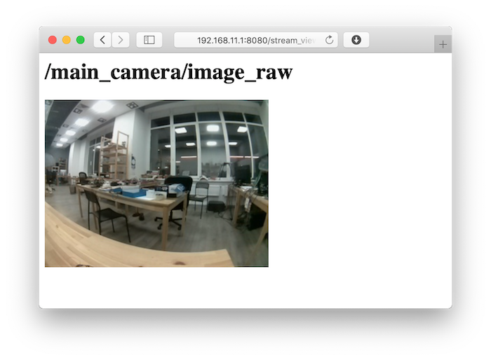

<p align="center"></p>
<h1 align="center"> ROS web-video-server </h1> 
<h4 align="right">Jun 23</h4>


<br>
 How to use USB camera with ROS -  image_view and web streaming.

 * Ubuntu 20.04
 * ROS Noetic


 <br>
 <br>

# Testing webcam 
## from GUI ubuntu
Application ***cheese***

## from console
```
sudo apt install ffmpeg
ffplay /dev/video0
```
## Check info webcam USB
```
ls /dev/video*
lsusb
```
se puede usar el siguiente comando para verificar el fabricante y la maarca de la webcam.

<br>

# Install usb_cam ROS Package 
```
sudo apt install ros-noetic-usb-cam 
```
el package `usb_cam` ya tiene un archivo launch de prueba. Se puede ver y editar en:
```
cat /opt/ros/noetic/share/usb_cam/launch/usb_cam-test.launch
```

<br>

## Run usb_cam test.launch
```
roslaunch usb_cam usb_cam-test.launch
```

> :warning: **Warning:** Si ROS esta corriendo en una RPI puede que solamente el `usb_cam node` inicie, el `image_view` (visualidaror de imagenes) podria fallar porque la RPI no podria tener recursos GUI.

<br>

## Topics node usb_cam 
```
rostopic list
```
`/usb_cam/camera_info`  #Es la salida del video en tiempo real <br>
`/usb_cam/image_raw`    #Informacion de como esta transmitiendo el video.

<br>

## image_view for read topic
```
rosrun image_view image_view image:=/usb_cam/image_raw
```


<br>

Documentation: http://wiki.ros.org/usb_cam

<br>

# Streaming Video with web-video-server

## Install web-video-server ROS Package
```
sudo apt install ros-noetic-web-video-server
```
## Create vidsrv package
```
cd ~/catkin_ws/src
catkin_create_pkg vidsrv std_msgs rospy roscpp
```

## Create vidsrv.launch
```
mkdir -p vidsrv/launch
nano vidsrv/launch/vidsrv.launch
```
vidsrv.launch
```
<launch>
  <!-- This node description you can take from usb_cam-test.launch -->
  <node name="usb_cam" pkg="usb_cam" type="usb_cam_node" output="screen" >
    <param name="video_device" value="/dev/video0" />
    <param name="image_width" value="640" />
    <param name="image_height" value="480" />
    <param name="pixel_format" value="yuyv" />
    <param name="camera_frame_id" value="usb_cam" />
    <param name="io_method" value="mmap"/>
  </node>
  <!-- This node will launch web video server -->
  <node name="web_video_server" pkg="web_video_server" type="web_video_server" />
</launch>
```
Compilation
```
cd ~/catkin_ws
catkin_make
```
## Run server
```
roslaunch vidsrv vidsrv.launch
```

## Web video stremming
Open URL browser <br>
`http://localhost:8080`<br>
`http://localhost:8080/stream_viewer?topic=/usb_cam/image_raw`

### Available URLs
Overview of available ROS topics: http://localhost:8080/<br>
Webpage showing a video stream: http://localhost:8080/stream_viewer?topic={ROS_TOPIC}<br>
Video stream URL: http://localhost:8080/stream?topic={ROS_TOPIC}<br>
Snapshot of next image: http://localhost:8080/snapshot?topic={ROS_TOPIC}<br>

<br>

Documentation: http://wiki.ros.org/web_video_server

<br>
<br>

---
Copyright &copy; 2022 [carjavi](https://github.com/carjavi). <br>
```www.instintodigital.net``` <br>
carjavi@hotmail.com <br>
<p align="center">
    <a href="https://instintodigital.net/" target="_blank"></a>
</p>


